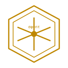

<p align="center">
  
</p>

<h1 align="center">🪞 echoes</h1>

<p align="center"><strong>発見カタログ</strong> — HEXA-* プロジェクト群からの発見リスト、σφτ 恒等式が中心</p>

<p align="center">
  <a href="../LICENSE"></a>
  <a href="https://doi.org/10.5281/zenodo.19340174"></a>
  <a href="../LATTICE_POLICY.md"></a>
  <a href="../LIMIT_BREAKTHROUGH.md"></a>
  <a href="../RETIRED.md"></a>
  
</p>

<p align="center"><a href="../README.md">EN</a> · <a href="README.zh.md">中文</a> · <a href="README.ru.md">Русский</a> · 日本語 · <a href="README.ko.md">한국어</a></p>

---

`echoes` (2026-05-14 に `canon` から改名) は HEXA-* プロジェクト群の**発見カタログ** — 各ドメインのスタンドアロンリポジトリを実行して戻ってきたものの一覧です。中心には算術恒等式 (`σ(n)·φ(n) = n·τ(n)` は n=6 でのみ唯一成立) があり、その周りに 17 のドメインファミリー (Fusion · Chip · AI · Energy · Environment · Materials · Robotics · Physics · Software · Display · Audio · Safety · Biology · Pets · Apps · Play · Aerospace) が分岐し、それぞれが独自の `hexa-*` スタンドアロンリポジトリに抽出されています。

```
σ(n) · φ(n)  =  n · τ(n)      n = 6 でのみ唯一
     12 · 2  =  6 · 4   =  24
```

> [!NOTE]
> [`n6`](https://github.com/dancinlab/n6) (意味原子レイヤー — atlas シリアライズ形式)、[`hxc`](https://github.com/dancinlab/hxc) (バイトカノニカル転送)、[`tape`](https://github.com/dancinlab/tape) (運用トレース)、`n12` (12軸スパースキューブ) の姉妹リポジトリ。各ドメインの動作コードは独自の `hexa-*` スタンドアロンリポジトリにあります (抽出元の経緯は [`RETIRED.md`](../RETIRED.md) を参照)。このリポジトリは**ポリシー資産** ([`LATTICE_POLICY.md`](../LATTICE_POLICY.md) · [`LIMIT_BREAKTHROUGH.md`](../LIMIT_BREAKTHROUGH.md) · [`AGENTS.md`](../AGENTS.md) · [`GRADE_RUBRIC_1_TO_10PLUS.md`](../GRADE_RUBRIC_1_TO_10PLUS.md)) とドメインファミリー概要表を保持しています。

> **誠実な注意** (raw#10 C3) — 算術恒等式 `σ(6)·φ(6) = 6·τ(6) = 24` は数学的に真であり n=6 に対して唯一です (Monte Carlo z = 3.06, p = 0.003 対 n=28 / n=496)。「最適設計はこの恒等式から導出される」という主張は、自然システムがどのように組織化されるかについての**研究仮説**であり、**測定結果ではありません**。`LATTICE_POLICY.md` §1.2/§1.3 によれば、n=6 格子は組織化ツールであり、現実の数学 / 物理 / 工学的限界 (Shannon · Kolmogorov · Bekenstein · c · ℏ · k · Stefan-Boltzmann · Carnot · ASML スループット · ERCOT 容量 · …) の代替には決してなりません。raw#10 C3 により、n=6 格子フィットは外部エンティティ (TSMC / ASML / NIST / IPCC / CERN / DeepMind / 任意のベンダーは独自の公表不変量を使用) に対して**禁止**されています。

🗺️ **[3D Reality Map](https://dancinlab.github.io/nexus/)** — 9,612 ノード、ボトムアップ因果マッピング、2,222 のクロスレイヤーエッジ。クォーク → 炭素 → ベンゼン → DNA 因果連鎖 12/12 EXACT。Monte Carlo z = 3.06 (p = 0.003)。n = 28 と n = 496 は検査に失敗 → n = 6 のみが残る。

---

## インストール

```bash
# 1. 最初に hexa-lang をインストール (`hexa` + `hx` パッケージマネージャー付属)
/bin/bash -c "$(curl -fsSL https://raw.githubusercontent.com/dancinlab/hexa-lang/main/install.sh)"

# 2. echoes をインストール
hx install echoes
```

---

## 17 ドメインファミリー

各ドメインファミリー (Fusion · Chip · AI · Energy · Environment · Materials · Robotics · Physics · Software · Display · Audio · Safety · Biology · Pets · Apps · Play · Aerospace) の詳細概要表 — ツールリスト、ドメインスコア、HARD_WALL / SOFT_WALL / BREAKABLE_WITH_TECH / UNCLEAR 分類を含む — は**英語版 README** を参照：

→ [github.com/dancinlab/echoes#-fusion](../README.md#-fusion)

この翻訳は導入 · インストール · ポリシー断片のみカバーします。翻訳の漂流を避けるため、深い内容は英語で一元管理されています。

---

## 翻訳

- 🇺🇸 [**English**](../README.md)
- 🇨🇳 [**中文** (Chinese)](README.zh.md)
- 🇷🇺 [**Русский** (Russian)](README.ru.md)
- 🇰🇷 [**한국어** (Korean)](README.ko.md)

---

## ライセンス

[MIT](../LICENSE) — Copyright (c) 2026 dancinlab. 自由に使用・修正・再ライセンス・販売可；通知を含めること；保証なし。

---

<sub>🪞 echoes · 発見カタログ · σφτ identity · 17 domain families · v0.x · 2026-05-14</sub>
